# MuchToman

**English** · [فارسی](README.fa.md)

An Android app that shows what all your money adds up to in Toman, and where it goes: a ledger
filled from bank SMS, budgets, savings goals and installments, for one person or, if you choose,
the whole family.

Persian UI, RTL, Persian digits, big type, and large amounts spoken the way people actually
say them ("4.7 billion Toman", not "4,666,251,136"). Built for a Persian-speaking parent, so
legibility beats density everywhere.

Holds plain Toman, fiat (USD, EUR, GBP, NOK, TRY, AED, CAD), **any of the top 250
cryptocurrencies**, 18k gold by the gram or the mesghal, silver by the gram at 999 and 925,
Iranian coins (Emami, Bahar Azadi, Nim, Rob, Gerami), Parsian coins by the sut, and shares, ETFs,
gold funds and bonds on the Tehran bourse and Farabourse. Everything is valued at **free-market**
rates — the official ~42,000 IRR peg is not used anywhere.

Cars, houses and villas, and land are held too, and are the only rows with no price behind them:
nobody quotes *your* car, so you type what it is worth in Toman and that figure is the value.

A Parsian coin is counted in sut and priced at the 1-gram coin's rate. The making charge is close
to fixed per coin, so the smallest pieces sell for more than that: a 100-sut piece goes for about a
quarter more than the gold in it.

## Screenshots

Sample data, live rates.

| Home | Assets | Ledger |
| --- | --- | --- |
|  |  | 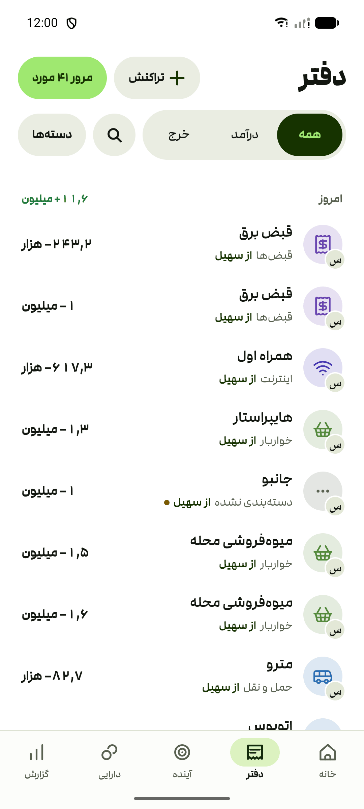 |
|  |  | 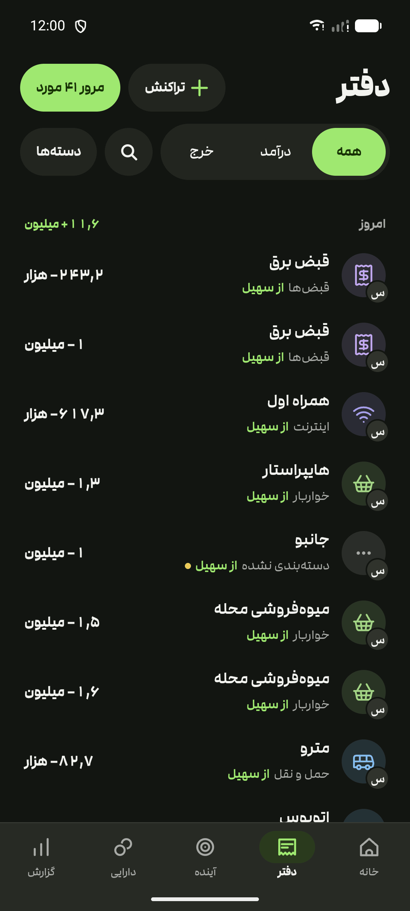 |

| Report | Future | Bank accounts |
| --- | --- | --- |
|  | 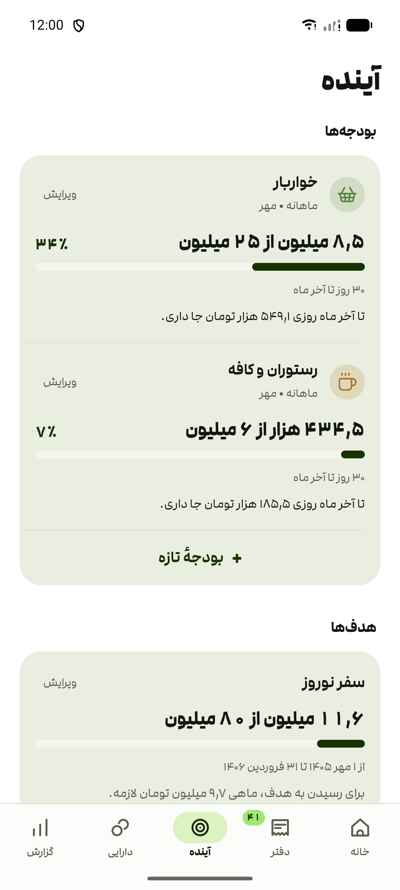 |  |
|  | 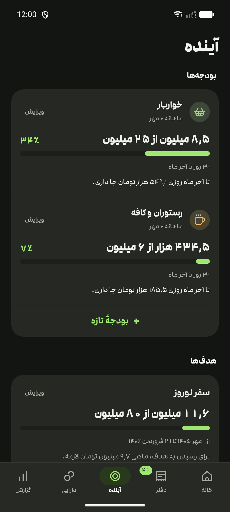 | 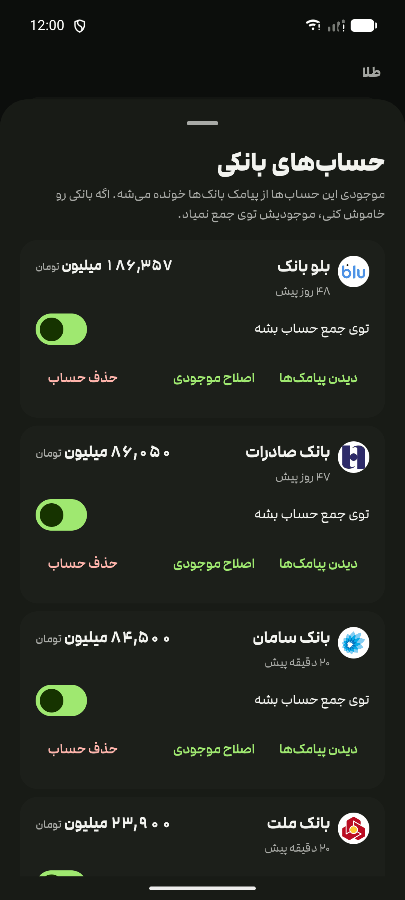 |

| Installments | Which installment did this pay? | Categories |
| --- | --- | --- |
| 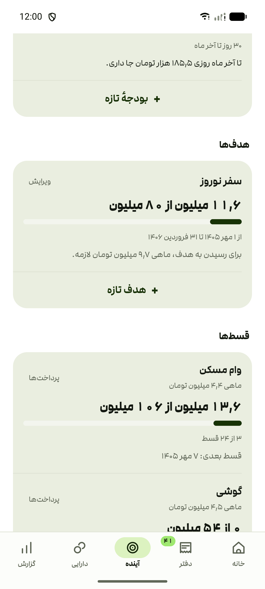 | 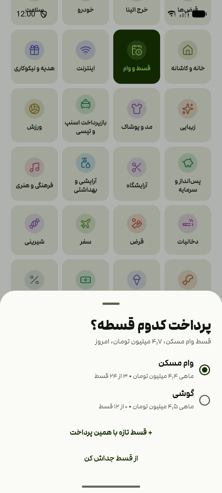 | 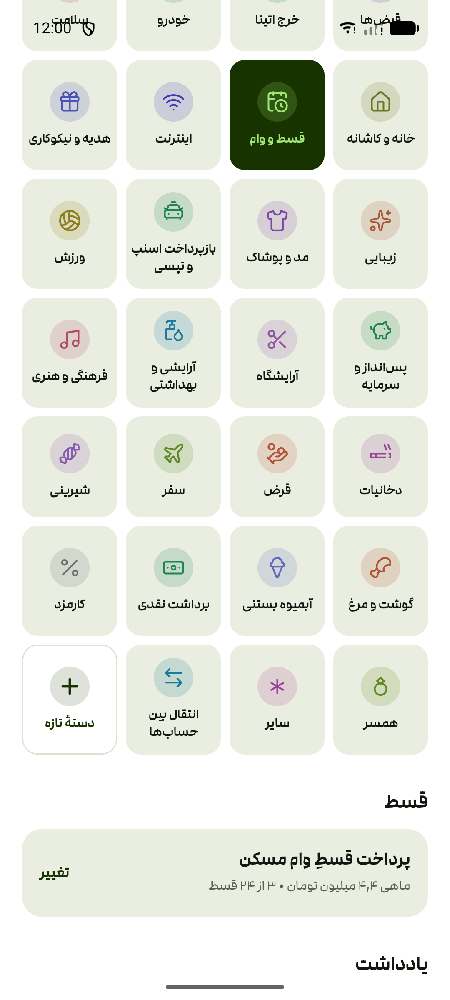 |
| 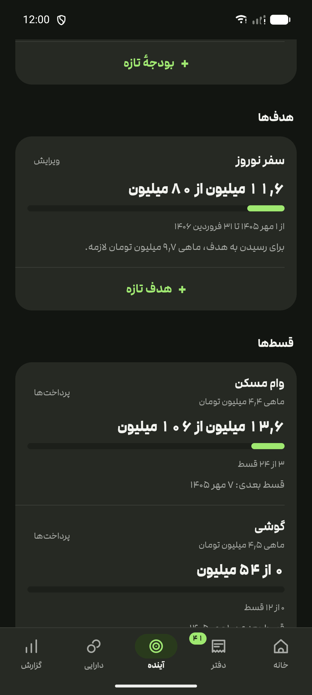 | 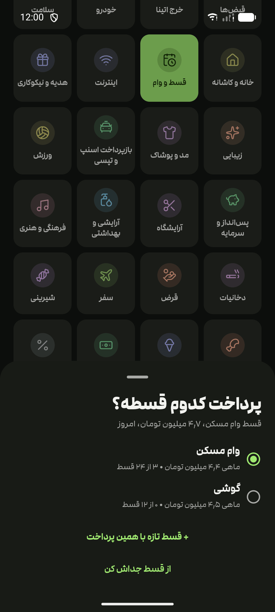 | 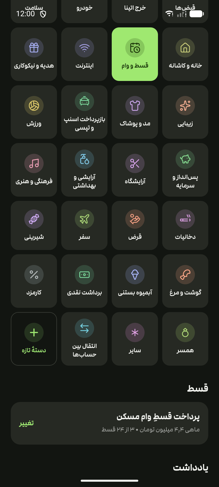 |

## What it does

- **One total, three ways.** Scannable ("10.8 million Toman"), spelled out in Persian words,
  and exact digits. Displayed figures truncate rather than round, so the number shown is never
  larger than the real one.
- **Bank balances from SMS.** Read and parsed locally from the phone's inbox, with no bank API.
  SMS sharing is off by default.
- **Budgets, per category.** Set a spending cap on "Restaurants & cafés" — weekly, monthly, or by
  season, the Jalali quarter. The card shows what is gone against what is left, how
  many days the window still has, and whether the spending is running ahead of the calendar. At 80%,
  at 95%, and once it goes past, the phone says so — once per window, never twice. The figure is the
  same one the Income & spending report shows for that category, computed from the transactions each time
  and never stored.
- **Savings goals, with a deadline.** "50 million in 6 months" carries the monthly rate that gets you
  there, and every card states the date its progress is counted from. No points, no streaks, no
  confetti, and no comparison with anybody else.
- **Installments, paid off by what the bank already reported.** A phone on twelve payments or a
  loan on sixty is a plan: how much each month, how many are left, and which day they fall due.
  Nothing is typed in twice. File a payment under "Installments & loans" and the app asks which plan it paid,
  or offers to start one from it, with that payment as the first installment; a plan's own sheet
  lists the transactions that could be its payments, the exact amount first. The card shows what is
  paid against the whole, the next due date, and, once a due date has passed unpaid, what is behind.
  Cash payments go into the ledger by hand and are linked the same way.
- **Where the money went, over any window.** Income & spending reads a week, a month, three, six or twelve,
  income against spending and category by category. Under each figure sits its daily and weekly
  pace, so windows of different lengths compare, and each closed window is also priced in dollars
  at the rates of the days it ran through, so a month you read once does not re-price itself later.
  Months from before that shipped have no rates on file and show no dollar figure.
- **Optional family ledger.** Two or more people can join by one-time QR code. Each person chooses
  whether their parsed SMS transactions are shared. Every shared item names its owner, and any
  family member can categorize it or write a note on it — a shared note says who wrote it. Which
  categories Income & spending sets aside is one choice the whole family shares, synced between the
  phones — and what those categories moved stays visible on the report, just outside the totals.
- **Public-wallet tracking, or manual entry.** Save a public address and the app refreshes BTC,
  ETH/ERC-20, SOL, TRX/TRC-20, and supported EVM-token balances on BSC, Arbitrum, Polygon,
  Optimism, and Avalanche. Anything else can be entered by hand.
- **Categories with their own marks.** Thirty-odd, from groceries to sweets and meat & poultry, each
  with a mark and a colour of its own, plus any you add. Filing a transaction with "Same category for
  similar ones" switched on files the ones like it the same way from then on.
- **Your own names.** Any holding can carry a label of your own — "Tether (mine)" beside
  "Tether (joint)". The asset keeps its real name underneath, so the rate still applies.
- **A year of history.** The total is remembered once a day, with 1/3/6/12-month change.
- **A backup only you can read.** Everything — messages, balances, every decision — exports to
  one passphrase-encrypted file and restores from it on a new phone. Settings show the last
  successful export and offer an optional reminder after 30 days.
- **Ledger health.** Settings show retained history, record counts and the last ingestion.
- **Browser companion.** Correct your own transactions, see unsent changes and switch saved
  households without mixing their records. After the first complete load, the shell works offline.
- **Search the ledger.** By merchant, note, category, or amount — in Persian, Arabic, or Latin
  digits, it does not matter.
- **Offline-tolerant.** The last good rates are cached on the phone.
- **Missing rates are never zero.** An asset with no price is left out of the total and named
  in a note, and any rate can be overridden by hand.
- **Optional app lock** (fingerprint or device PIN), off by default.
- Light and dark, following the system by default.

## Banks it reads

A message is read only if it came from one of these senders — identity is the sending number
or header, never words in the body.

| Bank | Sends from |
| --- | --- |
| Blu Bank | `0999 998 7641`, `90000258`, `+9890000258`, `98300087641` |
| Saman Bank | `0999 992 0000`, `+989820000`, `9820000`, `6219` |
| Refah Bank | `100031`, `100032`, `Refah Bank`, `RefahBank` |
| Pasargad Bank | `B.Pasargad` |
| Eghtesad Novin Bank | `ENBank`, `+98500015`, `+98200050` |
| Middle East Bank | `20004861`, `+9820004861`, `+989820004860` |
| Bank Saderat | `+98 9870 0719`, `98700719`, `+98 983 000 9419`, `BankSaderat` |
| Resalat Bank | `ResalatBank` |
| Parsian Bank | `PARSIANBANK`, `+98300054`, `+98300055`, `+9850001099` |
| Bank Mellat | `Bank Mellat`, `6104` |
| Bank Melli Iran | `6037`, `09830009417`, `+98700717` |
| Day Bank | `Day Bank`, `DayBank`, `+982000266`, `+982000766` |
| Tejarat Bank | `TejaratBank` |
| Bank Sepah | `SEPAH BANK` |
| Bank Keshavarzi | `KESHAVARZI` |
| Post Bank of Iran | `POSTBANK`, `+9850004940` |
| Bank Maskan | `Bank Maskan` |
| Mehr Iran Bank | `B.QMEHRIRAN`, `+989810008528` |

**Deliberately not read:** Ayandeh Bank. Its messages are shaped like balance updates but are not.

**Blu boxes** are your own money set aside inside Blu, so moving money into or out of a box is
filed as a transfer between accounts, never as income or spending.

**SMS only, not push notifications.** Some banks (Blu among them) let you take transaction
alerts as notifications from their own app instead of as SMS. There is no message to read in
that case, so the balance quietly stops at the last real SMS rather than reporting anything
wrong. Turn SMS alerts back on in that bank's own settings.

A bank that starts sending from a new shortcode becomes a suggestion card in the app; your tap
is what adds it, on that phone only. Some banks never earn a card, because their messages don't name
the bank or star out the balance. For those, the bank accounts sheet lists every unknown sender
whose messages carry an amount, and you say which bank it is.

## Install

Grab the APK from [Releases](https://github.com/doxigo/muchToman/releases). Each covers every
device, Android 7.0 (API 24) and newer.

Two of them are published side by side:

| File | What it is |
| --- | --- |
| `muchtoman-vX.Y.Z.apk` | everything below — the household ledger, goals, the companion phone |
| `muchtoman-lite-vX.Y.Z.apk` | Assets only: what you own and what it is worth today |

Take the lite one if you want a portfolio and not a budget. It installs beside the full app
under its own name and package, so you can have both on one phone and try the full
app without giving up the simple one. Both read the same bank SMS and get the same detection
fixes — they are one codebase, built twice.

If you are already running an earlier version, the plain `muchtoman-` file is your update: it
keeps its package, so the balances you typed in and every category you confirmed carry over.

New releases show up as a line under your total the next time you open the app. To be notified
without opening it, add `https://github.com/doxigo/muchToman` to
[Obtainium](https://github.com/ImranR98/Obtainium).

**On an iPhone**, open <https://sync.muchtoman.com> in Safari and add it to the Home Screen
(Share → Add to Home Screen). It is the same app in the browser — every screen and figure above —
except that iOS lets no app read your SMS, so you paste a bank message into the ledger instead.
Added to the Home Screen, its data is kept; in a plain Safari tab iOS may clear it after weeks
unused. Budget and instalment notes appear while it is open. Back it up from Settings, as on
Android.

## Where the prices come from

Free-market rates only — bonbast/tgju for fiat, gold and coins, and Iranian exchanges
(bitpin, tetherland) for crypto so the Tehran premium is real rather than a USD conversion.

## Privacy

No account, no login, no analytics SDK. Holdings, saved wallet links, and raw bank SMS live in the
app's own storage on the phone and are excluded from Android backup and device transfer. The
way off a dying phone is the app's own backup: one file, encrypted with a passphrase you
choose, holding everything — and readable by nobody without it, including the app.

The app tells its author two things about itself, and nothing else. The first rates request of
each day carries one header: the app's version and the store that installed it (Cafe Bazaar,
Myket, or Android's package installer for an APK from GitHub). The web app sends its version and
`pwa`. There is no identifier, so two phones on the same version from the same store send the same
bytes, and the totals are public at [muchtoman.com/usage](https://muchtoman.com/usage). After a
crash, the next launch shows the crash report and asks whether to send it: class names and code
line numbers with no exception messages, plus the Android version and phone model. It is sent only
if you say yes.

Family sync is optional and end-to-end encrypted. SMS sharing starts off. When a person enables
it, their phone shares only the parsed amount, direction, time, bank, merchant, and category. It
never uploads the raw SMS text. Manual family-ledger items are shared. The sync service can see
opaque household/member ids, record types, timestamps, and ciphertext, but not the transaction
contents or member names. Turning SMS sharing off sends deletion markers for that person's
previously shared SMS items. It cannot erase anything another member already saw or copied.

Notifications are computed and posted entirely on the phone. There are two: a budget of yours has
crossed a line you asked to be told about, and a transaction has landed that nothing has filed yet.
Neither leaves the device or reaches the family sync — not the category, not the cap, not the
merchant, not the fact that either happened. They sit on separate channels, so you can silence the
filing reminders and keep the budget alerts, or the other way round, in Android's own settings.

The first time the app opens, one screen says what each permission is for and asks for them
together: reading bank SMS and, on Android 13 and later, notifications. Refuse or skip it and it
does not come back. Reading bank SMS can be switched on later in Settings, and Future and Ledger
offer to turn notifications on whenever they have something to tell you. Denying notifications
costs the alerts and nothing else: the Future tab shows the same figures either way, and the
badge on Ledger counts the same backlog.

Installment plans, and which transactions paid them, stay on the phone. They are never part of
the family sync.

Wallet tracking is opt-in: when enabled, the public address is sent through the configured
Worker to a public blockchain RPC or indexer. The app never asks for a recovery phrase or private
key. Rates and coin logos come through the configured Worker. The only direct price-source
request is TSETMC, and only when the stock picker is opened or a stock is already held.

## Building it yourself

See [DEVELOPMENT.md](DEVELOPMENT.md).

## Credits

Category marks are [Lucide](https://lucide.dev)'s drawings (ISC), inked with the app's own pen.
The licence ships inside the APK.

The typeface is [Modam](https://fontiran.com/fonts/modam), from Fontiran.
