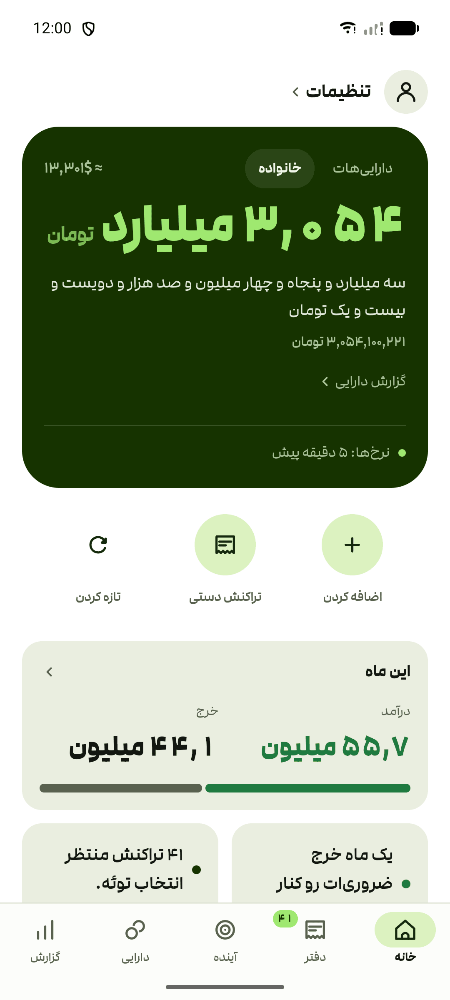
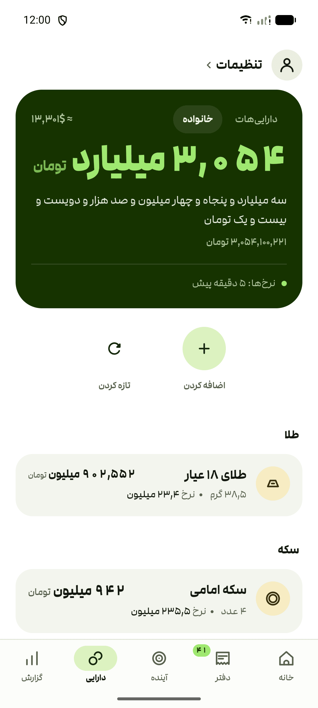
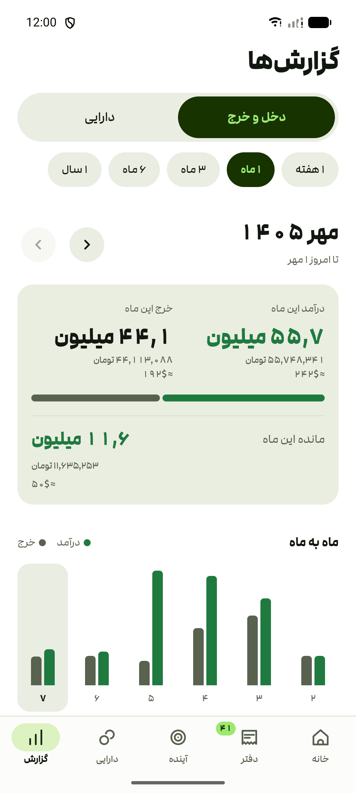
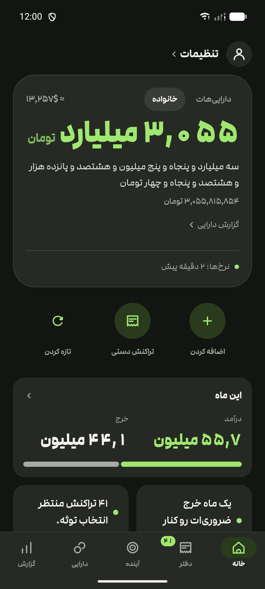
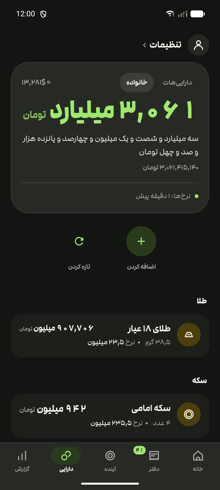
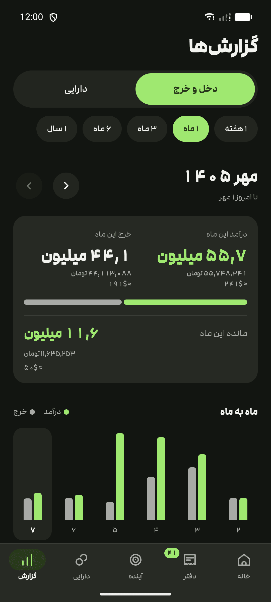
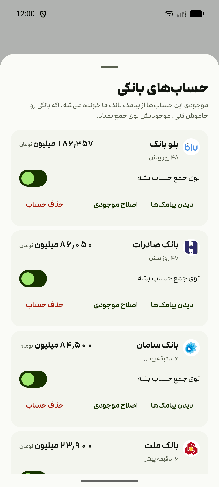

# چقدر تومن — MuchToman

An Android app that answers one question: *how much is all my money, in Toman?*

Persian UI, RTL, Persian digits, big type, and large amounts spoken the way people actually
say them ("۴٫۷ میلیارد تومان", not "۴٬۶۶۶٬۲۵۱٬۱۳۶"). Built for a Persian-speaking parent, so
legibility beats density everywhere.

Holds plain Toman, fiat (USD, EUR, GBP, NOK, TRY, AED, CAD), **any of the top 250
cryptocurrencies**, 18k gold by the gram or the مثقال, silver by the gram at ۹۹۹ and ۹۲۵,
Iranian coins (Emami, Bahar Azadi, Nim, Rob, Gerami), and سکه پارسیان in all fifteen sizes
from ۱۰۰ to ۱۵۰۰ سوت. Everything is valued at **free-market** rates — the official ~42,000
IRR peg is not used anywhere.

سکه پارسیان is quoted per size rather than weighed as gold: the اجرت is close to fixed per
coin, so a ۱۰۰ سوت piece goes for about a quarter more than the gold in it.

## Screenshots

Sample data, live rates.

| | | |
| --- | --- | --- |
|  |  |  |
|  |  |  |

## What it does

- **One total, three ways.** Scannable ("۱۰٫۸ میلیون تومان"), spelled out in Persian words,
  and exact digits. Displayed figures truncate rather than round, so the number shown is never
  larger than the real one.
- **Bank balances from SMS.** Read locally from the phone's inbox, no login and no bank API.
  Nothing leaves the device.
- **Public-wallet tracking, or manual entry.** Save a public address and the app refreshes BTC,
  ETH/ERC-20, SOL, TRX/TRC-20, and supported EVM-token balances on BSC, Arbitrum, Polygon,
  Optimism, and Avalanche. Anything else can be entered by hand.
- **Your own names.** Any holding can carry a label of your own — "تتر شخصی" beside "تتر
  مشترک". The asset keeps its real name underneath, so the rate still applies.
- **A year of history.** The total is remembered once a day, with 1/3/6/12-month change.
- **Offline-tolerant.** The last good rates are cached on the phone.
- **Missing rates are never zero.** An asset with no price is left out of the total and named
  in a note, and any rate can be overridden by hand.
- **Optional app lock** (fingerprint or device PIN), off by default.
- Light and dark, following the system by default.

## Banks it reads

A message is read only if it came from one of these senders — identity is the sending number
or header, never words in the body.

| Bank | Sends from |
| --- | --- |
| بلو بانک | `0999 998 7641`, `90000258`, `+9890000258`, `98300087641` |
| بانک سامان | `0999 992 0000`, `+989820000`, `9820000` |
| بانک رفاه | `100031`, `100032`, `Refah Bank`, `RefahBank` |
| بانک پاسارگاد | `B.Pasargad` |
| بانک اقتصاد نوین | `ENBank` |
| بانک خاورمیانه | `20004861`, `+9820004861`, `+989820004860` |
| بانک صادرات | `+98 9870 0719`, `98700719`, `+98 983 000 9419`, `BankSaderat` |
| بانک رسالت | `ResalatBank` |
| بانک پارسیان | `PARSIANBANK` |
| بانک ملت | `Bank Mellat` |

**Deliberately not read:** بانک آینده. Its messages are shaped like balance updates but are not.

**SMS only, not push notifications.** Some banks (Blu among them) let you take transaction
alerts as notifications from their own app instead of as SMS. There is no message to read in
that case, so the balance quietly stops at the last real SMS rather than reporting anything
wrong. Turn SMS alerts back on in that bank's own settings.

A bank that starts sending from a new shortcode becomes a suggestion card in the app; your tap
is what adds it, on that phone only.

## Install

Grab the APK from [Releases](https://github.com/doxigo/muchToman/releases). One APK covers
every device, Android 7.0 (API 24) and newer.

New releases show up as a line under your total the next time you open the app. To be notified
without opening it, add `https://github.com/doxigo/muchToman` to
[Obtainium](https://github.com/ImranR98/Obtainium).

## Where the prices come from

Free-market rates only — bonbast/tgju for fiat, gold and coins, and Iranian exchanges
(bitpin, tetherland) for crypto so the Tehran premium is real rather than a USD conversion.

## Privacy

No account, no login, no analytics. Holdings and saved wallet links live in the app's own
storage on the phone, are excluded from Android backup and device transfer, and bank SMS is
parsed on-device. Wallet tracking is opt-in: when it is enabled, the public address is sent
through the configured Worker to a public blockchain RPC or indexer. The app never asks for a
recovery phrase or private key. Rates and coin logos come through the configured Worker. The
only direct price-source request is TSETMC, and only when the stock picker is opened or a stock
is already held.

## Building it yourself

See [DEVELOPMENT.md](DEVELOPMENT.md).
